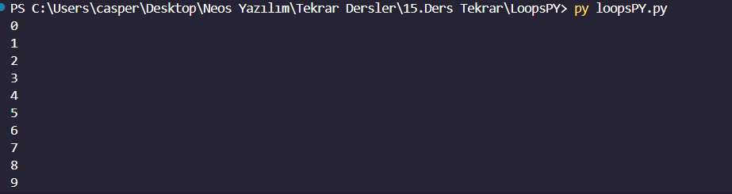
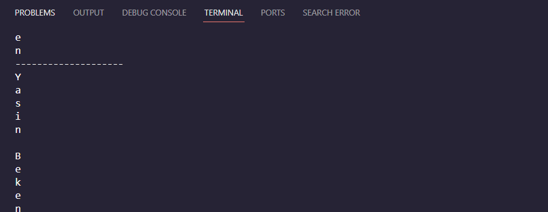
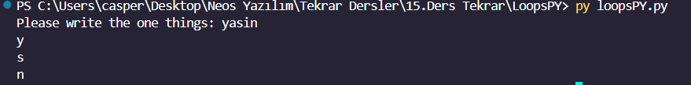

<h1><i>LOOPS PYTHON</i></h1>
<h3>Bank ATM Simulation</h3>

This Python script simulates a basic ATM (Automated Teller Machine) system for a bank. It allows users to perform various operations such as cash withdrawal, deposit, and checking balance. The ATM has an initial balance of 20,000 TL.

<h3>Features</h3>

Password Protection: Users are required to enter a password (default: 1234) to access the ATM functionalities. After three failed attempts, the card is blocked.

Balance Inquiry: Users can check their account balance at any time.

Cash Withdrawal: Users can withdraw cash from their account, provided they have sufficient balance.

Cash Deposit: Users can deposit cash into their account.

<h3>Implementation Details</h3>

The script is implemented in Python and structured as follows:

Password Verification: The user is prompted to enter the password. If the password is incorrect, the user has three attempts before the card is blocked.

Main Menu: Once the password is verified, the user is presented with a menu displaying their current balance and options for balance inquiry, withdrawal, deposit, and quitting the ATM system.

Balance Inquiry: Displays the current account balance.

Cash Withdrawal: Allows the user to withdraw cash from their account. If the withdrawal amount exceeds the account balance, an error message is displayed.

Cash Deposit: Allows the user to deposit cash into their account.

